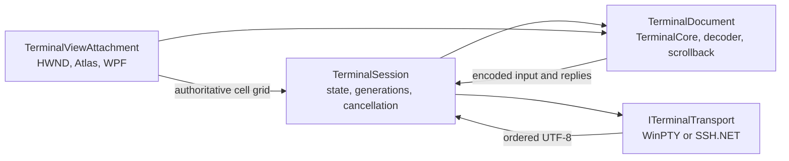

# Terminal document, transport, and typed-SSH handoff specification

Decision date: 2026-09-14. Implementation status updated 2026-09-17: 3A.1 and
3A.2 are implemented as 0.4.0/native ABI 11 and pass locally in Debug and
Release and on the exact Windows 7 SP1 x64 candidate. 3B, H01 and Milestone 5
remain future phases.

This specification turns the accepted WinPTY P01, input I01, outbound 0.3.7,
OpenSSH S00, and SSH.NET S01 results into one production ownership model. It also
defines how an ordinary `ssh user@example.com` entered in a VT7 local shell can
open an embedded SSH.NET terminal in the same tab and scrollback without making
the native HWND the lifetime owner.

The user gesture should feel like running `ssh` in a modern terminal: the command
is typed at the current prompt, the remote terminal uses the same viewport, and
the local prompt returns after SSH ends. The implementation is necessarily
VT7-specific. Windows Terminal normally runs the external `ssh.exe` inside
ConPTY; VT7 must use SSH.NET for a first-class Windows 7 remote PTY because S00
proved that the evaluated Windows OpenSSH client cannot obtain or track PTY
geometry when used as VT7's directly redirected process backend.

## Scope and acceptance boundary

This document fixes the following contracts before backend construction:

- TerminalCore, UTF-8 decoder, session, transport, and view ownership;
- independent presentation attachment and session lifetime;
- ordered inbound/output, outbound/input, resize, EOF, and teardown behavior;
- a replaceable local WinPTY and remote SSH.NET transport interface;
- a profile-controlled, per-local-session `ssh.exe` shim with secure local IPC;
- exact rules for embedded handling versus external OpenSSH fallback;
- trust, authentication, diagnostics, and secret boundaries;
- implementation stages and tests required before the typed-SSH path ships.

The C4/3A implementation closes when the document/view identity split and fake
transport lifecycle pass locally and on Windows 7. WinPTY production connection
is 3B. SSH.NET, trust UI, and the typed-SSH experience remain Milestone 5, after
the H01 shim/barrier diagnostic has passed. Writing this specification does not
claim that those later features exist.

The implemented ownership has one deliberate mechanical refinement. Upstream
TerminalCore stores the renderer controller address in its text buffer and VT
dispatch objects. ABI 11 therefore keeps that stable controller with
`TerminalDocument`, while `TerminalView` exclusively owns the HWND, Atlas engine,
font/DPI presentation state and callbacks. Detach parks and tears down the worker,
unregisters callbacks, removes and destroys the Atlas engine, and leaves the
controller dormant with the document. Reattach adds a new engine and restarts
the controller. This preserves the observable ownership contract without
rewriting inherited TerminalCore pointers.

The intended observable flow is:

1. the user enters `ssh user@example.com` at a normal local prompt;
2. that shell resolves VT7's session-local shim and waits for it as an ordinary
   foreground process;
3. the command and a short connecting barrier appear through WinPTY;
4. structured trust/authentication UI appears when required;
5. the remote PTY uses the same TerminalCore, viewport, and scrollback;
6. **Disconnect SSH and return to local shell**, remote EOF, or failure closes
   only the overlay; the shim exits and the original shell prints its next prompt.

For a clean interactive ShellStream close the shim returns 0; backend/policy
failure returns 255. The exact remote interactive shell status is unavailable
through the accepted public API and is never fabricated. An external fallback
returns the external client's exact status.

## Research conclusions that control the design

Microsoft Terminal separates a complete terminal instance from backend
connections and UI. Its code organization describes TerminalCore's `Terminal`
as the buffer, parser, colors, and input state without prescribing a UI, while
TerminalConnection contains backend implementations. Its WPF connection
contract exposes output, start, input, resize, and close separately. This is the
right dependency direction for VT7; it is an architectural reference rather
than source to copy. See the upstream
[organization guide](https://github.com/microsoft/terminal/blob/main/doc/ORGANIZATION.md),
[WPF connection contract](https://github.com/microsoft/terminal/blob/main/src/cascadia/WpfTerminalControl/ITerminalConnection.cs), and
[container](https://github.com/microsoft/terminal/blob/main/src/cascadia/WpfTerminalControl/TerminalContainer.cs).

Microsoft's `ConptyConnection` serializes input and, during close, waits for its
output thread so no asynchronous output handler can touch a destroyed consumer.
VT7 adopts that completion invariant for every transport; it does not adopt
ConPTY, which is unavailable on Windows 7. See
[`ConptyConnection.cpp`](https://github.com/microsoft/terminal/blob/main/src/cascadia/TerminalConnection/ConptyConnection.cpp).

SSH session channels allocate a PTY, start a shell, carry window-change
requests, and may report an exit status as distinct protocol messages. These
are separate from byte-stream EOF and channel close in
[RFC 4254](https://www.rfc-editor.org/rfc/rfc4254). SSH.NET 2026.0.0 exposes
`ShellStream.ChangeWindowSize`, blocking reads, writes, flush, and disposal, but
its public `ShellStream` API does not expose the interactive channel's remote
exit-status request. `SshCommand` exposes `ExitStatus`, but it is a separate
noninteractive execution API. This follows from the exact
[2026.0.0 `ShellStream` source](https://github.com/sshnet/SSH.NET/blob/2026.0.0/src/Renci.SshNet/ShellStream.cs),
[`ShellStream` API](https://sshnet.github.io/SSH.NET/api/Renci.SshNet.ShellStream.html), and
[`SshCommand` API](https://sshnet.github.io/SSH.NET/api/Renci.SshNet.SshCommand.html).
VT7 therefore must not invent a remote interactive exit status or use reflection
against SSH.NET internals.

OpenSSH accepts a broad grammar: remote commands, forwarding, jump/proxy
configuration, multiplexing, subsystems, configuration files, canonicalization,
and many `-o` settings. Its documented exit contract is the remote command's
status or 255 when an error occurs. See the OpenBSD
[`ssh(1)`](https://man.openbsd.org/ssh) and
[`ssh_config(5)`](https://man.openbsd.org/ssh_config) manuals. A transparent
reimplementation of that grammar is out of scope. The shim uses a small
allowlist and delegates every uncertain invocation to an exact external client.

Command interception can only be session-local and best-effort. Windows process
creation searches the application directory, parent current directory, system
directories, Windows directory, and then `PATH` when no path is supplied;
PowerShell also gives aliases, functions, and cmdlets precedence over external
executables, while an explicit path wins. See
[`CreateProcessW`](https://learn.microsoft.com/en-us/windows/win32/api/processthreadsapi/nf-processthreadsapi-createprocessw)
and [PowerShell command precedence](https://learn.microsoft.com/en-us/powershell/module/microsoft.powershell.core/about/about_command_precedence?view=powershell-7.5).
VT7 must respect those user choices and never edit the machine or user `PATH`.

Named pipes require an explicit security descriptor. Microsoft's documentation
states that the default descriptor grants read access to Everyone and anonymous
users, and recommends a logon SID in the DACL to exclude other Terminal Services
sessions. Windows 7 also supports retrieving the connected client's PID. See
[named-pipe security](https://learn.microsoft.com/en-us/windows/win32/ipc/named-pipe-security-and-access-rights)
and [`GetNamedPipeClientProcessId`](https://learn.microsoft.com/en-us/windows/win32/api/winbase/nf-winbase-getnamedpipeclientprocessid).
Pipe-name entropy alone is not an access-control mechanism.

The exact WinPTY 0.4.3 API exposes a duplicated handle to the spawned root
process and explicit size changes. It does **not** expose
`winpty_get_console_process_list`; that function appears in later source and
cannot be assumed from the pinned official binary. See the exact
[0.4.3 header](https://raw.githubusercontent.com/rprichard/winpty/0.4.3/src/include/winpty.h).
The shim can report the processes attached to its current console with Windows'
[`GetConsoleProcessList`](https://learn.microsoft.com/en-us/windows/console/getconsoleprocesslist),
while the host can inspect current ancestry with
[`CreateToolhelp32Snapshot`](https://learn.microsoft.com/en-us/windows/win32/api/tlhelp32/nf-tlhelp32-createtoolhelp32snapshot)
and defeat ordinary PID reuse with retained handles and
[`GetProcessTimes`](https://learn.microsoft.com/en-us/windows/win32/api/processthreadsapi/nf-processthreadsapi-getprocesstimes).
These are consistency checks; the DACL and capability remain the authorization
boundary.

## Rejected shortcuts

- Making WinPTY or SSH.NET a member of native `Surface` keeps HWND destruction as
  session destruction and blocks view recreation.
- Watching keystrokes for the text `ssh` bypasses shell parsing, aliases,
  functions, quoting, history expansion, and scripts. VT7 observes an actual
  executed shim process instead.
- Parsing the rendered command line is ambiguous and turns untrusted terminal
  output into control input.
- Redirecting the evaluated external OpenSSH client directly to VT7 pipes fails
  usable PTY geometry under S00. External fallback inside WinPTY is a separate
  compatibility path and does not replace first-class SSH.NET.
- Intercepting every OpenSSH option would silently change unsupported semantics.
  The allowlist/fallback rule is deliberately fail-safe.
- Starting remote output as soon as IPC arrives allows it to overtake WinPTY
  output. The visible barrier is required.
- Giving an SSH overlay a second TerminalCore loses same-tab mode/scrollback
  continuity or requires unsafe merging of two cores into one renderer.
- Pausing WinPTY reads during SSH can block the root console and lose final or
  background output. It remains continuously drained.
- Inherited handles alone are fragile across arbitrary shell grandchildren.
  A secured named pipe gives the handshake an explicit lifetime and protocol.
- Inferring a remote interactive exit status from EOF, terminal text, or a shell
  wrapper changes semantics. Version one reports only what the public backend
  actually observes.

## Required ownership model

The current native `Surface` owns `Terminal`, `Utf8TerminalStream`, Atlas,
`Renderer`, and HWND together, and `VT7_CreateSurface` returns the HWND itself as
the ABI handle. That proof arrangement cannot own a production connection.

The production model has four independent identities:



### `TerminalDocument`

`TerminalDocument` is presentation-independent native terminal state. It owns:

- an immutable 128-bit `DocumentId`;
- one TerminalCore `Terminal` instance;
- the active incremental UTF-8 decoder generation;
- main and alternate buffers, scrollback, cursor, parser and terminal modes;
- the authoritative columns and rows;
- document diagnostics and a monotonically increasing mutation sequence.

It owns no HWND, WPF object, renderer, process, socket, SSH client, credential,
or transport callback. It may exist with zero attached views and continues to
consume ordered output while detached.

Document mutation initially remains serialized on one application dispatcher.
This avoids a second cross-thread core owner during the port. The dispatcher is
owned by the application/session layer, not discovered through an HWND. A later
dedicated core thread is possible without changing the ABI or transport
contract.

### `TerminalSession`

`TerminalSession` is the managed orchestration owner. It owns:

- an immutable 128-bit `SessionId` and its `TerminalDocument`;
- the root transport and, when allowed, one active transport overlay;
- inbound and outbound bounded queues;
- transport, attachment, and prompt generations;
- current grid, state machine, cancellation, completion, and exit reason;
- the per-local-session shim endpoint and capability when enabled.

Only `TerminalSession` may switch the input destination or publish final session
completion. It is the single place that decides drain versus abandonment. A
transport never calls the native document or WPF view directly.

### `ITerminalTransport`

The managed transport boundary represents bytes and controls, not UI:

```csharp
internal interface ITerminalOutputSink
{
    Task WriteAsync(TerminalOutputBlock block, CancellationToken cancellationToken);
}

internal interface ITerminalTransport
{
    Guid TransportId { get; }
    long Generation { get; }
    TerminalTransportState State { get; }
    Task<TerminalTransportResult> Completion { get; }

    Task StartAsync(TerminalStartContext context, ITerminalOutputSink output,
        CancellationToken cancellationToken);
    Task WriteAsync(SessionOutboundOperation operation, CancellationToken cancellationToken);
    Task CloseAsync(TerminalCloseReason reason, CancellationToken cancellationToken);
}
```

The custom asynchronous `CloseAsync` avoids adding an `IAsyncDisposable`
compatibility package to the .NET Framework 4.8 host. The session always awaits
it. Concrete transports dispose their private streams, clients, process handles,
and cancellation objects inside that lifecycle; a failed factory cleans any
partially constructed owner before publishing it.

`TerminalOutputBlock` contains an owned byte block, generation, and producer
sequence. The read producer awaits `ITerminalOutputSink.WriteAsync`, so bounded
backpressure reaches the backend instead of ending at a fire-and-forget event.
`Completion` resolves exactly once and distinguishes clean EOF, reported exit,
connection failure, cancellation, and forced termination. After `CloseAsync`
completes, no output-sink call may begin; calls already admitted to the session
sequencer either drain under the same generation or are explicitly abandoned.

Resize remains a `SessionOutboundOperation` so its order relative to input is
defined. Consecutive undelivered resizes may coalesce to the newest grid.
`WinPtyTransport`, `SshNetTransport`, and deterministic fake transports implement
the same boundary. Backend-specific handles never escape their implementation.

### `TerminalViewAttachment`

The attachment owns the child HWND, Atlas renderer, renderer worker, DPI/font
presentation state, and WPF `HwndHost`. It holds a non-owning reference to one
document and an attachment generation. Version one allows at most one attached
view per document.

Destroying or recreating an attachment never ends a stream, resets TerminalCore,
closes a transport, or changes `SessionId`. Detach stops input admission and
render invalidation, destroys the HWND using the already-tested renderer order,
and leaves the document live. Reattach performs a full redraw from the existing
document.

Closing a tab is an application action that requests both session closure and
view destruction. WPF layout reconstruction, hide/show, device recovery, and
transient `HwndHost` destruction are presentation actions only.

## Native ABI 11 split

The implementation should introduce distinct opaque handles. Exact spelling may
change during code review, but the identities and call directions may not:

```c
VT7_CreateTerminalDocument(settings, &document);
VT7_DestroyTerminalDocument(document);
VT7_BeginDocumentStream(document, stream_generation);
VT7_WriteDocumentUtf8(document, stream_generation, origin_transport_generation,
    sequence, bytes, length);
VT7_ReadDocumentReply(document, &reply);
VT7_EndDocumentStream(document, stream_generation, eof_kind);
VT7_GetTerminalDocumentInfo(document, &info);

VT7_CreateTerminalView(parent_hwnd, document, renderer_mode, &view, &child_hwnd);
VT7_DetachTerminalView(view);
VT7_DestroyTerminalView(view);
VT7_GetTerminalViewInfo(view, &info);

VT7_EncodeTerminalKey(document, ...);
VT7_EncodeTerminalChar(document, ...);
VT7_EncodeTerminalFocus(document, ...);
VT7_ResizeTerminalDocument(document, attachment_generation, columns, rows);
```

Document calls must execute on the document dispatcher. View calls must execute
on the HWND's creating UI thread. The native layer validates nonzero generations,
rejects stale attachment/document generations, and never treats an HWND value as
a document handle.

Document and view handles are opaque typed objects with validation cookies, not
cast HWND values. A view holds a checked attachment to its document; the document
must outlive it. Destroying an attached document returns `ERROR_BUSY`. Destroying
a view first detaches it and unregisters renderer callbacks, then follows the
existing HWND/renderer-worker teardown. These rules make a wrong destruction
order a visible failure instead of a use-after-free.

During migration, `TerminalSurface` may remain as a managed compatibility facade
that creates a document plus view. New transport/session code must use the split
handles. Existing diagnostics may retain legacy exports for one ABI transition,
implemented over the new objects, then move to the new API before the old exports
are removed.

One document output pump is created when `TerminalSession` begins and ends only
when the root session reaches final EOF or abandonment. Starting or stopping an
SSH overlay never begins, ends, or replaces the incremental decoder. Each queued
write adds origin transport identity and sequence to the current 16-chunk pump.

TerminalCore's synchronous write-input callback must not reenter managed
transport code while the core lock is held. During each document mutation, the
native owner sets a scoped origin context and copies generated replies into a
bounded document reply queue. After the mutation and lock complete, the managed
pump drains `VT7_ReadDocumentReply`; every reply carries its origin transport
generation and reply sequence. Missing origin or reply-queue overflow fails the
session visibly. This implements originating-transport replies without a reverse
P/Invoke callback or lock inversion.

## Session and presentation state machines

The root session states are:

```text
Created -> StartingRoot -> RunningRoot -> Closing -> Closed
                    \-> Failed
```

A local session may additionally perform:

```text
RunningRoot -> StartingOverlay -> RunningOverlay -> StoppingOverlay -> RunningRoot
```

Only one SSH overlay is allowed. The root WinPTY transport remains alive and is
always drained while the overlay runs. Input bytes, paste, focus reports, terminal
replies, interrupt, and break route only to the active transport. Authoritative
resize routes to both the active overlay and the resident WinPTY transport so the
local shell has the correct size when it resumes.

A first-class SSH profile starts `SshNetTransport` as the root transport and has
no WinPTY process, shim, or overlay. Its document and view follow the same
ownership rules; when SSH completes, the session becomes closed while the view
may remain attached to display scrollback and the final result.

Presentation uses an independent state machine:

```text
Detached -> Attaching -> Attached -> Detaching -> Detached -> Destroyed
```

Transport generation increments whenever the active destination changes.
Attachment generation increments on every attach. Prompt generation increments
for every trust or authentication request. Every asynchronous callback carries
the relevant generation and is rejected when it no longer matches.

User input admission is closed during `StartingOverlay` after the shim request
is accepted and throughout `StoppingOverlay`. It opens on SSH only after the
barrier and PTY are ready, or on WinPTY only after the retained shim process has
actually exited. Bytes are not buffered across either routing transition.

## Ordinary typed `ssh` invocation

### Local environment setup

When VT7 starts a local shell, it builds a private Unicode environment block and
prepends a VT7-owned shim directory to that child session's `PATH`. It adds:

```text
VT7_SSH_PIPE=<unpredictable per-session local pipe name>
VT7_SSH_CAPABILITY=<256-bit random base64url value>
VT7_SYSTEM_SSH=<absolute external ssh.exe path, if accepted by S00 policy>
VT7_SYSTEM_SSH_SHA256=<expected external client hash>
VT7_SSH_PROTOCOL=1
VT7_SSH_MODE=embedded-eligible
```

The values exist only in the local session's process tree. VT7 does not modify
the parent process, registry, user environment, machine environment, or shell
profile. The original `PATH`, including drive-current-directory entries in the
environment block, is otherwise preserved.

The local profile exposes one setting: prefer embedded SSH for eligible typed
invocations. Disabling it omits the shim directory and sets `VT7_SSH_MODE=system`;
the installed client then resolves normally. This is a persistent user choice,
while `ssh-system` is the one-command bypass. After Milestone 5 acceptance, VT7's
built-in local shell profiles enable the setting by default; imported/custom
profiles retain their explicit value or default to system behavior.

The host resolves and validates `VT7_SYSTEM_SSH` before adding the shim directory.
It must be an absolute path, must not resolve to the shim, and is opened by exact
application path during fallback. The shim rechecks its SHA-256 immediately
before launch. The shim never invokes `ssh` by name, which would recurse.

This mechanism intentionally respects normal command resolution:

- `ssh user@host` normally finds the VT7 shim through the session `PATH`;
- a PowerShell alias/function/cmdlet named `ssh` keeps precedence;
- `C:\Program Files\OpenSSH\ssh.exe ...` and other explicit paths bypass VT7;
- `ssh-system ...` is supplied as an explicit external-client bypass;
- `scp` and `sftp` are never intercepted in the first implementation.

### Eligible grammar

Protocol version 1 embeds only an interactive shell request with no remote
command. It accepts:

- exactly one literal `[user@]host` destination or one exact VT7 SSH profile
  name;
- `-4` or `-6`;
- `-l user`;
- `-p port`;
- `-i absolute-or-current-directory-relative-key-path`.

Options may appear only in forms proven by H01. Duplicate or conflicting options,
an empty destination, an invalid port, control characters, and ambiguous tokens
are rejected from embedded handling. The host resolves profile data and key paths;
the shim does not read credentials or SSH configuration.

The shim also requires stdin, stdout, and stderr to be attached to its owning
WinPTY console and reports their handle types for host validation. A pipe, file,
invalid handle, different console, or shell capture/redirection forces external
fallback. This preserves `ssh host < input`, `ssh host > output`, `2> error`,
pipelines, and PowerShell output capture instead of silently displaying embedded
output in the viewport.

Everything else delegates to the external OpenSSH client, including:

- any arguments after the destination that form a remote command; shell command
  separators remain shell syntax and execute normally after the shim returns;
- `-N`, `-T`, `-W`, `-L`, `-R`, `-D`, `-J`, `-F`, `-G`, `-Q`, `-S`, `-O`,
  `-f`, subsystem requests, and forwarding;
- every `-o` option in protocol version 1;
- help/version/configuration inspection;
- syntax that the parser does not understand exactly.

Fallback is a feature contract, not an error. It preserves the installed
client's broad grammar, configuration behavior, command exit status, and user
escape hatch. If no accepted external client exists, unsupported syntax exits
255 after one actionable diagnostic.

Automatic fallback launches OpenSSH inside the owning WinPTY console, which is
a different path from S00's rejected directly redirected PTY. It remains subject
to P01 console reconstruction and is a compatibility path rather than the
first-class SSH backend. H01 must verify its process status, terminal dimensions,
resize behavior, cancellation, and absence of shim recursion before VT7 enables
automatic fallback. Explicit-path and `ssh-system` invocations remain the user's
direct request to run that installed client.

### Shim process behavior

The shim is a small VT7-authored native x64 console executable built for the
Windows 7 subsystem. It receives the CRT-decoded `argv`, current directory, its
PID, protocol version, and capability. It never sends a copied environment block,
password, passphrase, private-key bytes, or terminal content.

It connects to the session pipe for at most five seconds and receives one of:

```text
USE_EMBEDDED(request_id, barrier_text)
USE_SYSTEM(reason_code, external_path, expected_sha256)
REJECT(exit_code, reason_code)
```

For `USE_SYSTEM`, the shim checks that the absolute executable and expected hash
match the session fallback identity, rehashes the file, then creates that exact
external executable with the original argument vector and inherited
console/standard handles. It waits and returns the exact process exit code.
CreateProcess receives a non-null absolute application name and a correctly
quoted mutable command line.

Before that launch, the shim builds a sorted Unicode environment from its current
environment, removes every `VT7_SSH_*` variable, and removes each `PATH` element
whose canonical directory equals the shim directory. It preserves all other user
changes and per-drive current-directory entries such as `=C:`. This prevents
ProxyCommand or another external
child from resolving back to the VT7 shim and prevents the session capability
from reaching the external client. The pipe handle is closed or made
non-inheritable. `STARTUPINFOEX` with `PROC_THREAD_ATTRIBUTE_HANDLE_LIST` admits
only the validated stdin/stdout/stderr handles when handle inheritance is needed;
the shim does not leak arbitrary inheritable handles.

For `USE_EMBEDDED`, the shim writes `barrier_text` to its ordinary console,
flushes, reports `BARRIER_WRITTEN`, and waits on the pipe. It does not open a
network connection. On completion it returns the host-provided status. If the
pipe fails before embedded acceptance, it may fall back once. If it fails after
acceptance, it exits 255 and must not create a second SSH connection.

## IPC protocol and security

The server creates one duplex byte pipe per local session with:

- an unpredictable 128-bit name;
- `FILE_FLAG_FIRST_PIPE_INSTANCE`, overlapped I/O, and one active instance;
- `PIPE_REJECT_REMOTE_CLIENTS`; failure to create that Windows 7 endpoint fails
  H01 closed rather than silently weakening the pipe;
- an explicit DACL granting the current logon SID and LocalSystem only;
- no default security descriptor;
- a maximum 64 KiB frame, 256 arguments, and 32,767 UTF-16 code units total;
- length-prefixed binary fields, fixed little-endian integers, fresh 128-bit
  client and server nonces, and strict versioning;
- bounded connect, read, write, and idle waits.

The handshake is challenge-response:

1. the shim sends protocol version, claimed PID, and a random client nonce;
2. the host returns a random server nonce and current session generation;
3. the shim sends the bounded request plus
   `HMAC-SHA256(capability, canonical protocol/PID/nonces/generation/request)`;
4. the host validates the canonical frame and HMAC in constant time, then makes
   the process-association and eligibility decisions.

The capability is never sent through the pipe. The .NET Framework host uses
`RandomNumberGenerator` and `HMACSHA256`; the native Windows 7 shim uses
[`BCryptGenRandom`](https://learn.microsoft.com/en-us/windows/win32/api/bcrypt/nf-bcrypt-bcryptgenrandom)
and the BCrypt SHA-256 HMAC provider. A server nonce is single-use and invalidated
on disconnect, failure, or response, so a recorded request cannot be replayed.

After connection, the host calls `GetNamedPipeClientProcessId`, opens the client
with query rights, and retains that handle while validating the request. The PID
must match the shim's claimed PID. A Toolhelp snapshot must show a live ancestry
chain to the WinPTY root process; opened process handles and creation times must
be consistent with that chain. The shim's `GetConsoleProcessList` report must
contain both its PID and the retained root PID. The report is useful corroboration
but is client-supplied and therefore is not treated as authorization.

The host validates the session and transport generation. The capability is a
bootstrap secret for the root session's lifetime because a child process cannot
update its parent shell's environment. Concurrent requests are rejected in
protocol version 1, and repeated failures are rate-limited.

The capability prevents accidental or cross-session activation. It is visible
to descendants of the local shell and is not claimed to sandbox hostile code
already running as the same user in the same console. The DACL, capability,
local-only pipe, first-instance flag, challenge/response, and short pipe lifetime are
the authorization boundary; PID, ancestry, creation-time, and console-list checks
add association and replay evidence without overstating WinPTY 0.4.3's API.

Malformed, oversized, stale, unauthenticated, or wrong-console requests receive
no parsing detail. Security failures are counted by category and do not include
arguments, endpoint, username, key path, or capability in logs.

## The ordering barrier

IPC and WinPTY screen scraping are independent producers. An IPC request can
arrive before the command echo and prior console output have emerged from
WinPTY. Starting SSH output immediately would corrupt the user's visible order.

After accepting an eligible request, the host generates a unique printable line,
for example:

```text
VT7: connecting to example.com [7f2a]
```

The shim writes it through the normal console path. The root WinPTY reader feeds
all preceding output and the complete barrier line into the session inbound
sequencer. A bounded recognizer matches the exact byte sequence only while that
request is pending. Only after the document mutation sequence containing the
barrier commits may `SshNetTransport` publish remote output and become the active
input destination.

The line remains visible; the recognizer does not delete or rewrite WinPTY
output. A timeout, transformed/truncated marker, root transport failure, or
document-generation change cancels embedded startup and returns failure 255.
H01 must first prove exact marker behavior through WinPTY on Windows 7 in Command
Prompt, Windows PowerShell 5.1 with Croatian HR Latin input, and PowerShell
7.2.24.

Every inbound producer submits an owned byte block to one session sequencer. The
sequencer assigns the total document sequence at admission. No transport writes
TerminalCore concurrently. Root WinPTY output continues to drain during the SSH
overlay; background local-console output is therefore retained and ordered by
observed admission time.

Each document write also carries its originating transport ID and generation.
TerminalCore replies produced while parsing that write inherit the origin and
return to that transport if it is still live. They do not automatically follow
the current user-input destination. This prevents a device-status query from a
background local process from being answered on the SSH channel.

## SSH.NET transport contract

`SshNetTransport` uses the exact accepted SSH.NET 2026.0.0/net48 dependency
closure and notice set from S01. It performs these stages with separate deadlines
and cancellation reporting:

1. resolve an explicit VT7 profile or literal destination;
2. load structured trust material and authentication methods;
3. connect and complete host-key verification before authentication proceeds;
4. create one `ShellStream` with the current columns, rows, pixel width, pixel
   height, a 1 MiB internal buffer, and the S01-proven `xterm-256color` terminal
   type; later terminal names require capability review;
5. start one dedicated blocking reader;
6. publish owned chunks of at most 64 KiB to the session inbound sequencer;
7. serialize writes, flushes, and `ChangeWindowSize` calls through the session
   outbound queue.

The reader uses the blocking `Read` path only. It does not also consume
`DataReceived`; two consumers would make ownership and ordering ambiguous.
`Read == 0`, channel close, session disconnect, read failure, local cancellation,
and trust/authentication failure map to distinct internal completion reasons.

`Interrupt` writes its already encoded ETX bytes to the remote terminal. The
public ShellStream API has no SSH break-request method. `Break` therefore returns
an explicit unsupported-control result and a bounded in-app status; it must not
silently write ETX and erase the I01 distinction. A supported upstream or
source-level extension may close this gap later.

Embedded SSH also does not emulate OpenSSH's line-start escape language. Tilde
bytes pass to the remote PTY. VT7 supplies a first-class **Disconnect SSH and
return to local shell** command/key binding that closes only the overlay.
Users who require exact OpenSSH local escapes use `ssh-system` or an explicit
client path.

On local close or cancellation, the mandatory order is:

1. stop accepting new outbound work for the SSH generation;
2. dispose `ShellStream`, which wakes the blocking reader;
3. await the reader and already-admitted inbound writes;
4. disconnect and dispose `SshClient`;
5. publish exactly one transport completion;
6. release authentication objects and secret buffers.

This is the ownership order proven by S01. Calling `Disconnect` while the stream
reader is still owned is forbidden.

The public ShellStream limitation fixes the version-one status mapping:

- clean remote EOF/channel close: shim exit 0;
- trust, authentication, connection, transport, local-policy, or abnormal close:
  shim exit 255;
- an external OpenSSH fallback: exact external process exit code;
- noninteractive remote commands: external OpenSSH, preserving the remote command
  status contract.

An exact interactive remote shell status is recorded as unavailable, never
fabricated. If it becomes a product requirement, VT7 must obtain a supported
upstream SSH.NET API, separately review and test a source-level MIT extension,
or reassess the backend. Reflection against private members is not an acceptable
production dependency.

## Input, resize, and terminal state at overlay boundaries

The same `TerminalDocument` is used before, during, and after SSH. It is not
cleared or recreated. That preserves the local command, remote session, final
message, and resumed prompt in one scrollback.

Embedded handoff additionally requires a safe document boundary after the
barrier: the parser is in its ground state, no incremental UTF-8 fragment is
pending, and the main buffer is active. An invocation from an active alternate
screen or an incomplete control sequence uses external fallback. This avoids
pretending that nested alternate-buffer ownership can be restored losslessly.

Input is encoded against that document's current TerminalCore modes. The existing
native HWND remains the sole committed-text source. Encoded key bytes, paste,
focus reports, and control actions carry the active transport generation.
TerminalCore replies carry the generation of the inbound write that produced
them. Stale items are rejected rather than rerouted to whichever transport
happens to be current later.

The view supplies one authoritative cell grid. `TerminalDocument` applies the
resize once. The session then enqueues the same newest grid to the active SSH
transport and resident WinPTY transport. SSH.NET sends a protocol window-change;
WinPTY uses `winpty_set_size`. No backend types text into a shell to simulate a
resize.

Before an overlay starts, the document captures a small
`TerminalInteractionSnapshot`: active-buffer identity and host interaction modes
that can trap input, including alternate-screen, mouse tracking, focus reporting,
bracketed paste, cursor-key/application-keypad behavior, and cursor visibility.
On normal completion, ordinary remote output remains untouched. If the remote
leaves an interaction mode active or termination is abnormal, a native
`NormalizeAfterTransportOverlay` operation restores the captured host-interaction
state without clearing main-buffer content or replacing scrollback. This is a
direct core operation with regression tests; VT7 must not inject fake remote VT
bytes to repair local state.

After SSH completion is sequenced, VT7 closes input admission, normalizes the
document, appends and commits a short host-owned result line, and selects a new
WinPTY transport generation with its input gate still closed. It then signals
the shim and waits on the client process handle retained during IPC validation.
Only after the shim exits does the session enter `RunningRoot` and admit input;
the local shell's next prompt arrives through the normal root stream. The result
line states the outcome category and does not claim a remote status that was not
observed.

## Backpressure and thread rules

The current inbound limit remains 16 owned chunks of at most 64 KiB. The current
outbound admission limit remains 256 operations. Limits are implementation
constants with measured diagnostics, not license to drop data.

- A transport reader awaits inbound capacity. Hidden or detached views still
  drain into TerminalCore; only rendering is suppressed.
- No UI thread blocks on transport I/O, connection, pipe, or teardown tasks.
- No transport lock is held while invoking WPF, trust UI, TerminalCore, or user
  callbacks.
- A full keystroke/control queue becomes a visible session failure and stops
  further input admission. It never silently drops or reorders input.
- Large paste is chunked, cancelable, and backpressured before production use.
- Consecutive pending resize operations may coalesce; input, replies, interrupt,
  break, and focus operations may not.
- Continuations use asynchronous scheduling. Disposal must not synchronously
  wait on the WPF dispatcher.

The session sequencer is the only writer to `TerminalDocument`. Each transport
has at most one read producer and one serialized outbound consumer. Diagnostics
may observe counters through snapshots but may not take core or transport locks
in the reverse order.

## Terminal output and host-action policy

Local and remote terminal bytes are untrusted. A parser callback carries the
originating transport ID/generation and document mutation sequence. The session
validates it after leaving the core lock and before any WPF or operating-system
action. Detached/hidden documents still parse bytes but do not perform desktop
actions.

- OSC title requests are capped at 1,024 UTF-16 code units, stripped of control
  characters, stored as untrusted session text, and applied only while the
  origin is current. Titles are not diagnostics.
- OSC 52 clipboard write is disabled by default and never opens a modal prompt
  merely because output requested it. A future per-profile opt-in requires a
  visible user notification, decoded-size limit, and current generation. Remote
  clipboard reads remain denied to prevent local clipboard exfiltration.
- OSC 8 hyperlinks may retain a bounded URI as document metadata. VT7 opens one
  only after a user activates the rendered range and confirms a non-default
  scheme. The click path revalidates the URI; parser output never launches it.
- Working-directory metadata is bounded, origin-scoped, and display-only. A
  remote path is never passed to a local filesystem API or treated as a local
  restore directory.
- Window move/resize/show, notifications, MIDI, arbitrary file transfer, and
  unknown host actions are denied in the initial product. Bell/activity signals
  may update bounded in-app state with rate limiting.
- Device/status replies are data-plane operations, not desktop actions, and use
  the originating-transport reply queue defined above.
- Diagnostic replay suppresses every host action and reply by default. Tests
  must opt into a fake action sink and can never touch the real clipboard,
  browser, filesystem, or window manager.

Payload limits are enforced before copying into long-lived WPF/session objects.
An oversized or stale action is rejected and counted by category without logging
its content. This policy is consistent with the broader
[VT protocol and security research](../research/19-vt-protocol-and-security.md).

## Trust, authentication, and privacy

Host-key trust is resolved before authentication. VT7 distinguishes unknown,
matching, changed, revoked/policy-rejected, and unreadable trust records. Unknown
keys require an explicit structured UI decision. Changed keys block by default
and cannot be replaced by an ordinary password prompt or terminal text.

Trust keys are indexed by canonical host, port, algorithm, and key material
fingerprint. Writes use validated, atomic replace with a recoverable prior copy.
Session and prompt generations are checked again when an asynchronous dialog
returns.

Passwords and key passphrases are entered in WPF secure prompts and remain in
the authentication owner for the minimum useful lifetime. Version one does not
persist passwords. The shim and terminal byte stream never receive credentials.
Private-key contents, password/passphrase values, capability values, full argv,
terminal data, endpoints, usernames, key paths, and host fingerprints are
excluded from default diagnostics.

Useful privacy-safe events include session/transport IDs generated by VT7,
backend kind, stage, duration, byte/operation counts, grid, negotiated algorithm
names, result category, queue high-water marks, and normalized Win32/HRESULT or
SSH.NET exception category. Publication tooling must still sanitize evidence.

SSH.NET host-key and interactive authentication callbacks are synchronous. They
run on the connection worker, post a generation-scoped request to WPF, and wait
there with a deadline/cancellation token. They never block the UI thread or hold
a transport/core lock. Closing the session resolves outstanding requests as
cancelled; a late UI answer is discarded by prompt generation.

## Failure and shutdown policy

Application/session close is bounded and idempotent:

1. mark the session closing; invalidate prompt, attachment-input, and active
   transport generations;
2. stop shim admission and complete or break outstanding handshakes;
3. close the SSH overlay first using stream-dispose-before-client-disconnect;
4. close WinPTY input, request ordinary child termination, drain according to
   the selected close reason, then apply bounded forced termination policy;
5. await or explicitly abandon admitted document writes;
6. detach/destroy the view with the established native renderer order;
7. end the document stream, destroy the document, and publish completion once.

A transient view detach executes only step 6. Root child exit closes the local
session after final drain. SSH overlay exit pops only the overlay. Root failure
during an overlay makes the whole session fail after SSH is closed. Host process
failure causes the accepted shim to exit 255; it never falls through into a
duplicate external connection.

No callback may begin after its owner reports close complete. The transport's
output-sink reference is revoked before backend objects are released, and its
completion task resolves only after active sink calls return. A callback that
was queued earlier must pass generation validation again at the session
sequencer.

## Implementation sequence

### 3A.1: native document/view split

Implemented in 0.4.0/ABI 11 and validated in Debug and Release locally and on
the exact Windows 7 target candidate.

- Extract `Terminal`, `Utf8TerminalStream`, grid, and core diagnostics from
  `Surface` into `TerminalDocument`.
- Make renderer/HWND state a `TerminalView` attached to a document.
- Add ABI 11 split handles and a temporary legacy facade.
- Move input encoding to the document handle.
- Move `SessionOutputPump` from `TerminalSurface.Dispatcher` to the document
  dispatcher.
- Prove detach, hidden drain, reattach, and teardown with deterministic output.

### 3A.2: managed session contract

Implemented in 0.4.0 and validated locally and on Windows 7 with deterministic
fake root and overlay transports. The production transports begin in 3B and
Milestone 5.

- Add `TerminalSession`, `ITerminalTransport`, state/result types, and generations.
- Adapt the current outbound queue to an active transport sink without changing
  its ordering rules.
- Add fake root/overlay transports and deterministic boundary normalization.
- Remove backend ownership from `MainWindow`; it owns a session and attachment.

### 3B: WinPTY root transport

- Wrap pinned WinPTY 0.4.3 in `WinPtyTransport`.
- Preserve P01's final drain, process-handle, size, and reconstruction limits.
- Launch Command Prompt, Windows PowerShell 5.1, and PowerShell 7.2.24 through
  explicit profiles and Unicode environment blocks.

### H01: typed-command shim and barrier diagnostic

- Build the native shim and exact fallback quoting tests.
- Implement the secured named-pipe handshake and PID/console membership check.
- Prove command resolution and the visible barrier through each required shell
  on Windows 7 before enabling embedded handling.

### Milestone 5: SSH.NET and typed handoff

- Implement structured profiles, trust storage, authentication UI, and
  `SshNetTransport` using the accepted S01 closure.
- Pass direct-profile SSH first.
- Enable the typed shim allowlist only after direct SSH lifecycle, overlay tests,
  and H01 pass.
- Keep fallback available and visible in diagnostics.

## Verification matrix

### Document and view

- Destroy and recreate the HWND 100 times while one document retains exact
  buffer, cursor, modes, stream counters, and document ID.
- Feed 131,071 irregular bytes with no attached view; reattach and compare the
  final core snapshot and raster to an always-attached control.
- Reject input, resize, render, and recovery callbacks from an old attachment
  generation.
- Exercise detach at every partial UTF-8 boundary; document EOF behavior remains
  independent of the view.
- Close view-only and session-plus-view paths repeatedly; verify bounded handles,
  threads, USER/GDI objects, and exactly-once destruction.

### Fake transport lifecycle

- Assert the state machine and exact completion category at every transition.
- Race output, EOF, close, resize, queued replies, and view detach against 100
  root/overlay cycles.
- Verify command echo, preceding root output, complete barrier, first SSH byte,
  last SSH byte, host result line, and resumed root prompt in that order.
- Continue root output during the overlay and prove one total document sequence.
- Fill inbound and outbound queues; verify backpressure or explicit failure with
  no silent loss.
- Reject every stale transport, prompt, and attachment generation.
- Normalize an overlay that leaves alternate screen, mouse, focus, bracketed
  paste, cursor, and application-key modes active without clearing scrollback.

### H01 command and IPC

- Command Prompt, Windows PowerShell 5.1, and PowerShell 7.2.24 on Windows 7;
  Croatian HR Latin committed input in both PowerShell versions.
- Ordinary `ssh`, alias/function precedence, explicit path bypass, `ssh-system`,
  per-profile opt-out, current-directory behavior, Unicode/space paths, and an
  absent external client.
- stdin/stdout/stderr redirection, pipelines, PowerShell capture, invalid handles,
  and different-console launch always select exact external fallback.
- Quoted arguments, IPv4/IPv6 literals, `user@host`, `-4`, `-6`, `-l`, `-p`, and
  `-i`; every unsupported form must take exact external fallback.
- Host absent before acceptance, host failure after acceptance, pipe timeout,
  external process exit propagation, and no recursion or duplicate connection.
- Wrong/stale-session capability, replayed HMAC/frame, wrong PID, PID reuse check,
  unrelated same-user
  process, different WinPTY console, oversize frame, truncated frame, unknown
  protocol, replay, concurrency, and remote pipe connection.
- Exact barrier recognition through WinPTY 0.4.3, including output immediately
  before and after the marker and window resize during the wait.

### SSH.NET overlay

- Repeat S01 public-key, optional password, encrypted key, unknown/changed host,
  live resize, 131,071-byte drain, cancellation, and isolation cases through the
  production session boundary.
- Disconnect during DNS/connect, trust prompt, authentication, PTY allocation,
  blocked read, blocked write, resize, rekey, and final drain.
- Abrupt server close, network loss, malformed UTF-8, slow consumer, hidden view,
  view recreation, root failure, and app shutdown.
- Verify clean ShellStream close maps to 0 and unreported remote status is never
  displayed as observed; command invocations use external OpenSSH and preserve
  its exit code.
- Run `vim`, `htop`, `tmux`, `mc`, `less`, mouse, bracketed paste, alternate
  screen, Unicode, 256-color, and true-color cases on the controlled Debian 12
  server.

## Explicitly deferred decisions

- Full OpenSSH command/configuration compatibility is not promised.
- `scp`, `sftp`, tunnels, jump/proxy hosts, multiplexing, agent forwarding, and
  remote commands are external-client operations in version one.
- Multiple simultaneous views of one document and nested local transport
  overlays are out of scope.
- Remote reconnection never replays submitted input automatically.
- Persisted passwords and a private SSH-agent implementation require separate
  security designs.
- Exact ShellStream interactive exit status remains an upstream/backend gap.
- SSH protocol BREAK and OpenSSH local escape commands remain explicit embedded-
  backend gaps; VT7 exposes a local disconnect action and never silently maps
  Ctrl+Break to Ctrl+C.
- Broader IME/accessibility contracts remain in 3C/Milestone 4, but the lifetime
  split must leave room for document-owned accessible text and view-owned bounds.

## Source and license disposition

This specification incorporates no new third-party code or binary. Microsoft
Terminal/OpenConsole and WinPTY are MIT-licensed architectural/API references;
SSH.NET 2026.0.0 and its exact permissive dependency closure are already audited
and approved in the
[S01 license record](../research/2026-09-14-sshnet-license-audit.md). Any later
code adoption must update `NOTICE.md`, exact package provenance, gratitude, and
distribution notices under the standing
[third-party licensing policy](2026-09-14-third-party-licensing-policy.md).
